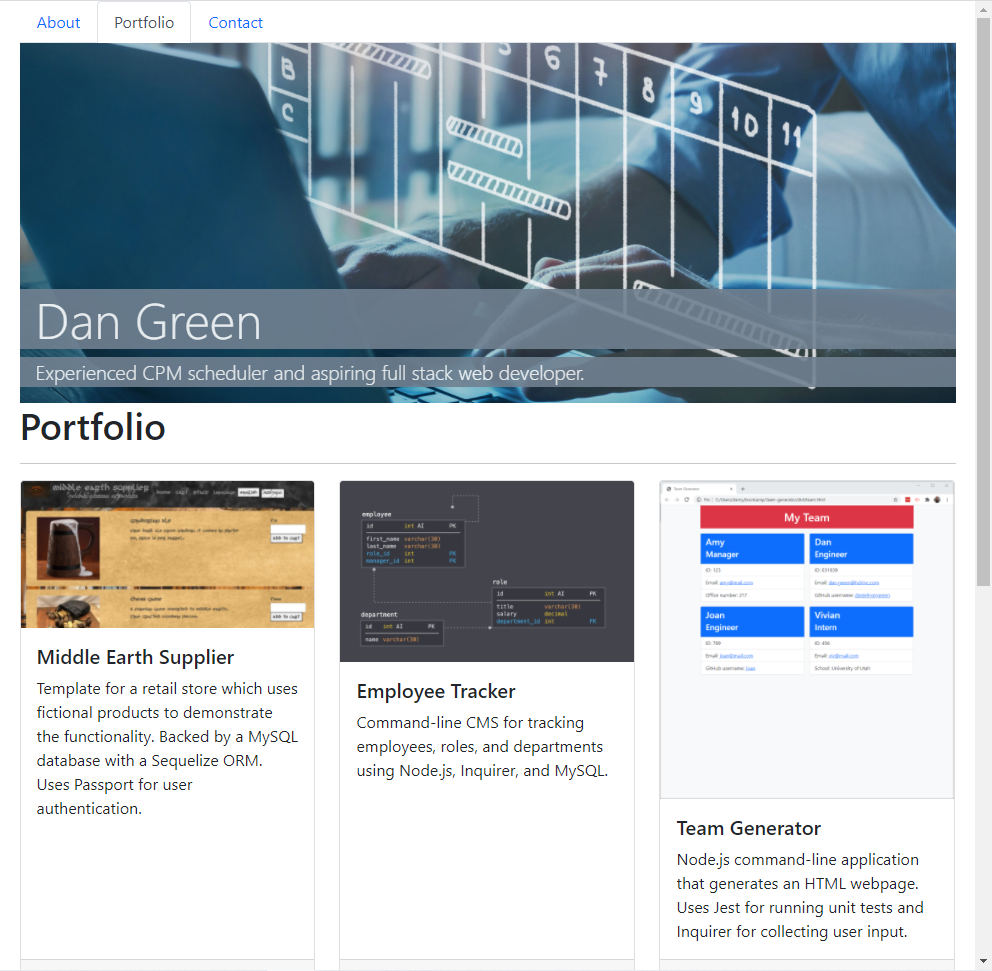

# React Portfolio
  
  ## Description
  Refactored my portfolio to use React. Includes a Header component and a Footer component that appear on each page. Uses dynamic rendering for navigation. Includes a single Project component that renders the cards on the Portfolio page.

  Deployed at [GitHub Pages](https://danielryangreen.github.io/react-portfolio/).

  See the repo at [GitHub](https://github.com/danielryangreen/react-portfolio).

  
  ## Table of Contents
  * [Installation](#installation)
  * [Usage](#usage)
  * [Credits](#credits)
  * [License](#license)
  * [Contributing](#contributing)
  * [Tests](#tests)
  * [Questions](#questions)
  ## Installation
  To install required packages, navigate to the `react-portfolio` directory and enter `npm i`.
  ## Usage
  To run the application, enter `npm start`.
  ## Credits
  The following resources were used in this project:

  - [Node.js](https://nodejs.org/en/)
  - [React](https://reactjs.org/)
  - [Bootstrap](https://getbootstrap.com/)
  - [npm gh-pages](https://www.npmjs.com/package/gh-pages)
  ## License
  This project is covered under the MIT license.
  ## Contributing
  Please submit a pull request.
  ## Tests
  Not provided.
  ## Questions
  Please contact me at dan.ryan.green@gmail.com. See my work on GitHub at [danielryangreen](https://github.com/danielryangreen/).